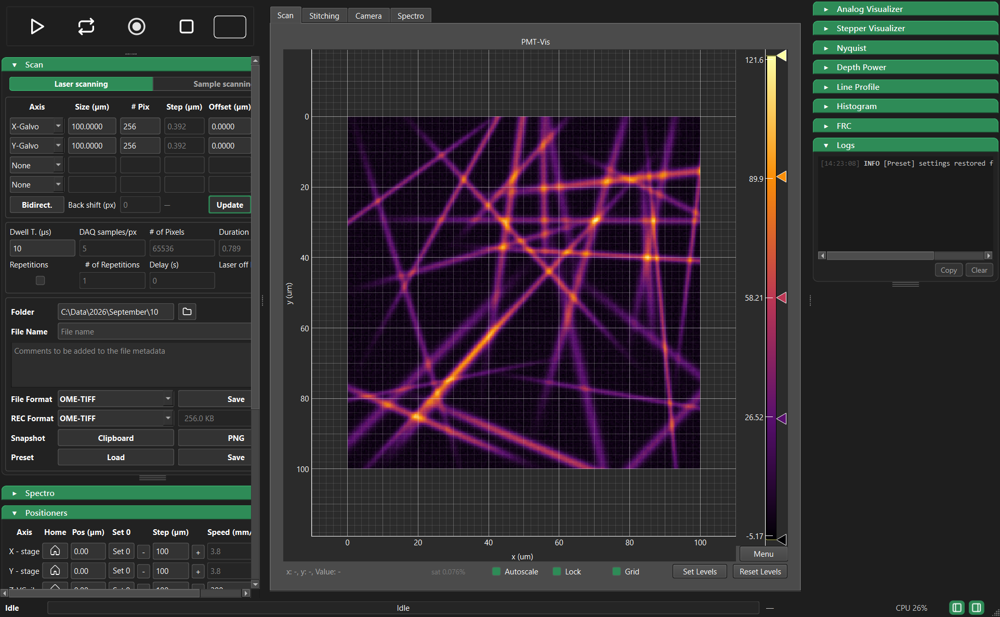

# DeepLight

Acquisition software for a multiphoton microscope: laser and sample scanning,
polarisation-resolved second-harmonic imaging, and Brillouin and Raman
spectroscopy on the same bench, from one window.



DeepLight drives the microscope built at LP2N (Laboratoire Photonique, Numérique
et Nanosciences, Talence). It is written for
that instrument, but the parts that touch hardware sit behind small contracts —
a microscope backend, a camera, a detector, a spectrograph — so a different
bench can be supported by writing a backend rather than by editing the
application.

Every installation-specific value (COM ports, serial numbers, driver paths, the
data directory) lives in one configuration file. There are no command-line flags
to remember and no start-up dialog.


## What it does

**Scanning.** Up to four nested axes, chosen per row: two galvanometer mirrors
for laser scanning, or the XY stage for sample scanning, plus a Z voice coil and
a polarisation axis. A stack is therefore any combination — a Z stack, a P-SHG
angle series, a time series through repetitions, or several at once. The panel
shows the pixel count, the step, the total duration and the file size before
anything starts.

**Detection.** Four channels: two analog PMTs integrated over the dwell time by
the NI card, and two photon-counting channels on NI counters. Each displayed
image carries the fraction of pixels sitting on the input range limit, so a
saturated PMT — which otherwise just looks well contrasted — announces itself.

**Polarisation-resolved SHG.** A half-wave and a quarter-wave plate are driven
together from a calibration table that maps a requested azimuth at the sample to
the two plate positions, interpolating between measured points. The angles
actually visited are listed in the saved file's provenance, so a plane index
never has to be matched back to an angle by hand.

**Brillouin and Raman.** A Princeton Instruments camera behind a spectrometer
for Brillouin, and an IsoPlane 320 spectrograph for Raman. Both run against a
software mock until the hardware is present. Brillouin datasets can be written
in the HDF5-BLS 1.0 format used by the Brillouin community.

**Mosaics.** Tiled acquisition with overlap and per-tile registration, including
stacks per tile. The extent is checked against the stage limits before the first
move, rather than failing on the corner that leaves the range.

**Depth compensation.** Raises the incident power with depth so the power in the
focal volume stays constant through a Z stack, following a Beer–Lambert law, and
returns the laser to its surface power at the end.

**Analysis panels.** Line profile, ROI histogram, Fourier ring correlation, live
waveform and stepper visualisers, and a Nyquist calculator that turns the
objective, wavelength and process order into the sampling the scan should use.


## Installing

DeepLight needs **Python 3.10 or newer**. It runs on Windows for real
acquisitions, because the vendor drivers do; the simulated backend runs
anywhere.

```bash
git clone <repository-url>
cd DeepLight
python -m pip install -e .
```

That is enough to run everything against the simulated microscope. For a real
acquisition PC, add the vendor drivers:

```bash
python -m pip install -e ".[hardware]"
```

These are `nidaqmx`, `pythonnet` (Thorlabs Kinesis) and `pipython` (Physik
Instrumente). Each is imported lazily and behind a guard, so DeepLight starts and
runs on the mock backend when none of them is installed. The vendor runtimes
themselves — NI-DAQmx, Kinesis, PI GCS, PICam — are installed separately, from
the manufacturers; DeepLight ships no third-party binaries.

`requirements.txt` and `requirements-hardware.txt` list the same dependencies for
installing without the package. To reproduce an exact environment on an
acquisition PC, generate a lock file there with `pip freeze` rather than
tightening the bounds in those files.


## Running

```bash
deeplight --backend mock      # simulated microscope, no hardware needed
deeplight --backend nidaq     # the real instrument
```

`python -m DeepLight --backend mock` does the same thing and needs no install,
as long as the working directory is the one holding the package.

Anything DeepLight does not recognise on the command line is passed through to
Qt, so `-platform` and friends still work.

### Keyboard

| | |
|---|---|
| `Space` / `Ctrl+Space` | single preview / continuous preview |
| `Esc` | stop |
| `F1` / `F2` | pull the black / white point onto the image extremes |
| `Ctrl+R` / `Ctrl+Return` | draw a zoom ROI / apply it as the next field of view |
| `F9` / `F10` | fold the left / right panel |
| `Ctrl+P` / `Ctrl+Shift+C` | snapshot to PNG / to the clipboard |
| `Ctrl+Q` | toggle the shutter |


## Configuration

On first run DeepLight writes a commented configuration file and logs its path.
Every key in it is optional and every value shown is the built-in default, so the
generated file changes nothing — edit only what differs on this machine.

It is looked up in this order, first hit winning:

1. `$DEEPLIGHT_CONFIG` — a full path; an escape hatch, rarely needed.
2. `deeplight.toml` next to the package (git-ignored).
3. `%APPDATA%\DeepLight\config.toml`, or `~/.config/deeplight/config.toml`
   elsewhere. **This is the recommended location:** each acquisition PC keeps its
   own and it never collides with the repository.

It holds what differs between installations: the NI device name and input range,
COM ports, device serial numbers, the Kinesis and PICam paths, the Raman
spectrograph optics and wavelength calibration, and the root of the data tree.
Constants that are properties of a hardware *model* rather than of an
installation stay in the code, where they cannot be adjusted into being wrong.


## What gets written

| Format | Used for |
|---|---|
| **OME-TIFF** | images and stacks (`TCZYX`), mosaics as BigTIFF with a pyramid past 2048 px |
| **OME-Zarr** | NGFF 0.4, written as the acquisition proceeds |
| **HDF5-BLS** 1.0 | Brillouin datasets |
| **PNG** | snapshots, with a scale bar burnt in |
| **CSV** | stage position of every acquired point, in acquisition order |

Files carry their physical scale: `PhysicalSizeX/Y/Z` in the OME-TIFF and a
`coordinateTransformations` scale in the NGFF metadata, so Fiji and napari open
an acquisition in micrometres rather than in pixels.

Beside the data goes a record of how it was taken — the build of DeepLight down
to the git revision, the sampling, the objective and its numerical aperture, the
lasers that were on, the polarisation angles visited, the detectors, any dark or
flat correction applied, and the operator's comment. It travels in the JSON
sidecar for TIFF, in the Zarr attributes, and in the HDF5-BLS attributes. A log
file is written next to each acquisition as it runs, and one per session under
`<data root>/logs`.

An acquisition can be saved as a **preset** and reloaded later. The preset is the
same description the scripting API consumes, so a series set up by hand can be
replayed by a script.


## Scripting

The window is one caller of the manager layer; a script is another. The same
plan builder, acquisition manager and writers are used, with the same provenance.

```python
from DeepLight import Axis, Recipe, Session, polarization_sweep

with Session(backend="nidaq") as session:
    result = session.run(Recipe(
        axes=[
            Axis("X-Galvo", pixels=512, size_um=100.0),
            Axis("Y-Galvo", pixels=512, size_um=100.0),
            polarization_sweep(count=8, span_deg=180.0),
        ],
        dwell_us=4.0,
        detectors=["PMT-Vis"],
        folder=r"D:\data", filename="pshg",
        comment="P-SHG series, 8 azimuths",
    ))
    print(result.frames, "planes ->", result.path)
```

`session.move("Z-Vcoil", 40.0)` returns once the stage has arrived, so a batch
over depths or positions is a loop. A `Recipe` is plain data: it round-trips
through JSON and can be kept in a file next to its results.

`DeepLight/examples/pshg_sweep.py` runs a polarisation sweep and a depth series
end to end; try it on the mock backend first:

```bash
python -m DeepLight.examples.pshg_sweep --backend mock
```


## Hardware

| Role | Device |
|---|---|
| Acquisition card | National Instruments (analog in/out, counters) |
| XY stage | Scientifica Motion 8 |
| Z | Physik Instrumente V-308 voice coil |
| Shutter | Thorlabs KCube solenoid |
| Waveplates | Thorlabs Elliptec ELL14 (three on a shared bus) |
| Laser power | Thorlabs rotation mounts, per laser |
| Lasers | Spark Lasers ALCOR 920, Cobolt Flamenco 660, Coherent Mira 900, Tumecs |
| Detectors | PMTs (analog) and photon counting (NI counters) |
| Brillouin | Princeton Instruments camera via PICam |
| Raman | Princeton Instruments IsoPlane 320 + PI camera |
| Widefield camera | OpenCV-compatible camera |

Every one of these has a software mock, selected with `--backend mock` or per
instrument in the configuration file, so the whole application can be exercised
without a bench.

Each family sits behind a small contract — a base class, a simulated
implementation and a validator that refuses an incomplete one — so supporting
another brand means writing one class rather than editing the application.
[docs/adding-hardware.md](docs/adding-hardware.md) walks through it with a
shutter and a power actuator as worked examples.


## Repository layout

```
DeepLight/
├── __main__.py         entry point: python -m DeepLight, and the deeplight command
├── api.py              scripting API: Session, run()
├── recipe.py           an acquisition as plain data, no Qt
├── config.py           the configuration file: template, lookup, defaults
├── examples/           runnable scripting examples
└── gui/
    ├── main_window.py          the window and what it orchestrates
    ├── main_window_design.py   layout, built by hand (no .ui file)
    ├── managers/               everything that is not a widget
    │   ├── Microscopes/        backends: mock and NI-DAQ
    │   ├── Scan_manager.py     turns scan parameters into an execution plan
    │   ├── Acquisition_Manager.py
    │   ├── Hardware_Manager.py drivers: stages, lasers, shutter, waveplates
    │   ├── Save_Manager.py     OME-TIFF, OME-Zarr, HDF5-BLS
    │   ├── Provenance.py       what travels beside the data
    │   └── ...
    └── widgets/                the panels
```

The manager layer holds no widgets, which is what lets the scripting API reuse it
whole. The modules that need only numerics — `Scan_Types`, `Frame_Builder`,
`Field_Correction`, `recipe` — import without pulling in Qt.


## Documentation

- [docs/user-guide.md](docs/user-guide.md) — the panels, the workflows and the
  keyboard shortcuts.
- [docs/adding-hardware.md](docs/adding-hardware.md) — putting a different
  instrument behind DeepLight.
- `config.py` — every setting that differs between installations, with its
  default and what it is for.


## Tests

```bash
python -m pip install -e ".[dev]"
pytest
```

The suite runs against the simulated microscope, so it needs no hardware and
takes a couple of seconds. It covers the scan geometry, the recipe an
acquisition is described by, the hardware contracts each device family has to
satisfy, the configuration file, and a full acquisition written to disk and read
back — the pixels, the physical scale and the provenance.


## Contributing

Bug reports and patches are welcome through the repository's issue tracker.

Two conventions worth knowing before sending a patch: user-facing strings and
docstrings are in English, while inline comments may be in French; and anything
that varies between installations belongs in `config.py`, not in the code.


## Licence

**To be determined before release.** DeepLight is intended for an open-source
release under an OSI-approved licence; the choice is pending with LP2N and CNRS.


## Citation

A software paper is in preparation. Until it appears, please cite the repository
and the git revision recorded in the provenance of the data you used.


## Acknowledgements

Developed at LP2N (CNRS UMR 5298 — Université de Bordeaux — Institut d'Optique
Graduate School), Talence, France.
